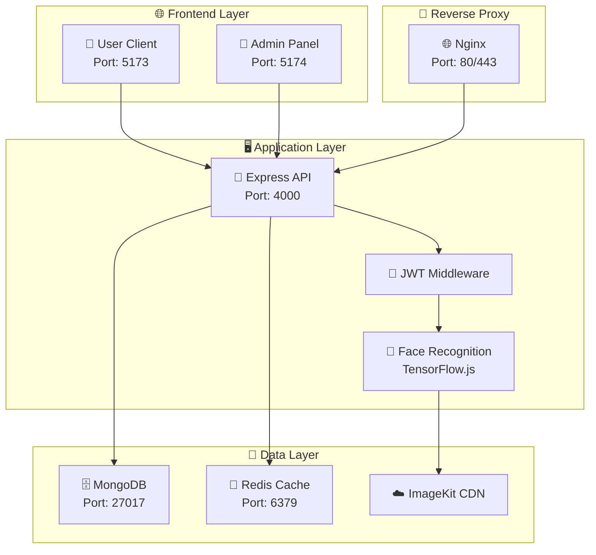

# 📁 Project Structure Documentation

## Face Recognition Attendance System
*Created by [Aayush Vaghela](https://github.com/AAYUSH412)*

---

## 🚀 Quick Start Scripts

### 🎯 Main Commands
```bash
# Start all services (client, server, admin)
./start-all.sh

# Start with dependency installation
./start-all.sh --install

# Start using Docker
./start-all.sh --docker

# Stop all services
./stop-all.sh

# Using npm scripts (alternative)
npm run dev              # Start all services
npm run install-all      # Install all dependencies and start
npm run docker:dev       # Start with Docker
npm run stop            # Stop all services
```

---

## 🏗️ Complete Project Structure

```
Face-Recognition-Attendance-System/
├── 📄 README.md                    # Main project documentation
├── 📄 PROJECT_STRUCTURE.md         # Project structure documentation
├── 📄 package.json                 # Root package.json with workspace config
├── 📄 .gitignore                   # Git ignore rules
├── 📄 .dockerignore                # Docker ignore rules
├── 📄 .env.example                 # Environment variables template
├── 🚀 start-all.sh                 # Main startup script for all services
├── 🛑 stop-all.sh                  # Script to stop all services
├── 🐳 Dockerfile                   # Production Docker configuration
├── 🐳 docker-compose.yml           # Production Docker Compose
├── 🐳 docker-compose.dev.yml       # Development Docker Compose
│
├── 📂 docker/                      # Docker Configuration Files
│   ├── ⚙️ nginx.conf              # Nginx reverse proxy configuration
│   ├── ⚙️ supervisord.conf        # Supervisor process management
│   ├── 🚀 startup.sh              # Container startup script
│   └── 📄 mongo-init.js           # MongoDB initialization script
│
├── 📂 server/                      # Node.js Backend API
│   ├── 📄 package.json            # Server dependencies & scripts
│   ├── 📄 index.js                # Main server entry point
│   ├── 📄 seedData.js              # Database seeding script
│   ├── 📄 SEEDING_INSTRUCTIONS.md  # Database setup instructions
│   ├── 📄 LOGIN_CREDENTIALS.md     # Login credentials for testing
│   ├── 🐳 Dockerfile.dev          # Development Docker config
│   ├── ⚙️ .env.local              # Local environment variables
│   ├── 📄 Face_Recognition_Attendance_API.postman_collection.json
│   │
│   ├── 📂 middleware/             # Express Middleware
│   │   └── 📄 auth.js             # JWT authentication middleware
│   │
│   ├── 📂 models/                 # MongoDB Schemas
│   │   ├── 📄 User.js             # User model schema
│   │   ├── 📄 Attendance.js       # Attendance record schema
│   │   ├── 📄 Event.js            # Event model schema
│   │   ├── 📄 EventAttendance.js  # Event attendance junction table
│   │   └── 📄 Department.js       # Department model schema
│   │
│   ├── 📂 routes/                 # API Route Handlers
│   │   ├── 📄 auth.js             # Authentication routes
│   │   ├── 📄 users.js            # User management routes
│   │   ├── 📄 attendance.js       # Attendance tracking routes
│   │   ├── 📄 events.js           # Event management routes
│   │   ├── 📄 departments.js      # Department management routes
│   │   └── 📄 demo.js             # Demo/testing routes
│   │
│   └── 📂 utils/                  # Server Utility Functions
│       ├── 📄 imagekit.js         # ImageKit cloud storage integration
│       ├── 📄 qrCodeHelper.js     # QR code generation utilities
│       └── 📄 hometempate.js      # Home page template
│
├── 📂 client/                     # React User Frontend
│   ├── 📄 package.json            # Client dependencies & scripts
│   ├── 📄 index.html              # HTML template
│   ├── 📄 vite.config.js          # Vite build configuration
│   ├── 📄 tailwind.config.js      # TailwindCSS configuration
│   ├── 📄 postcss.config.js       # PostCSS configuration
│   ├── 📄 eslint.config.js        # ESLint configuration
│   ├── 📄 README.md               # Client-specific documentation
│   ├── 🐳 Dockerfile.dev          # Development Docker config
│   │
│   ├── 📂 public/                 # Static Assets
│   │   ├── 🖼️ icons8-attendance-48.png # Application icon
│   │   ├── 🖼️ Face Recognition Attendance System-logo.png
│   │   ├── 🖼️ apple-touch-icon.png
│   │   ├── 🖼️ favicon.ico
│   │   ├── 🖼️ favicon.svg
│   │   ├── 📄 site.webmanifest     # Web app manifest
│   │   └── 🖼️ vite.svg           # Vite logo
│   │
│   └── 📂 src/                    # Source Code
│       ├── 📄 main.jsx            # Application entry point
│       ├── 📄 App.jsx             # Main App component
│       ├── 🎨 index.css           # Global styles & Tailwind imports
│       │
│       ├── 📂 Auth/               # Authentication Components
│       │   ├── 📄 Login.jsx       # User login form
│       │   └── 📄 Register.jsx    # User registration form
│       │
│       ├── 📂 components/         # Reusable UI Components
│       │   ├── 📄 Layout.jsx      # Main layout wrapper
│       │   ├── 📄 PrivateRoute.jsx # Protected route component
│       │   ├── 📄 NotFound.jsx    # 404 error page
│       │   ├── 📄 Dashboard.jsx   # User dashboard
│       │   ├── 📄 Profile.jsx     # User profile management
│       │   ├── 📄 Events.jsx      # Events listing component
│       │   ├── 📄 AttendanceCapture.jsx # Face recognition capture
│       │   ├── 📄 AttendanceHistory.jsx # Attendance history view
│       │   ├── 📄 QRCodeScanner.jsx # QR code scanning component
│       │   └── 📂 ui/             # Shared UI Components
│       │       ├── 📄 Avatar.jsx
│       │       ├── 📄 Badge.jsx
│       │       ├── 📄 Button.jsx
│       │       ├── 📄 Card.jsx
│       │       ├── 📄 Chart.jsx
│       │       ├── 📄 Forms.jsx
│       │       ├── 📄 Input.jsx
│       │       ├── 📄 Progress.jsx
│       │       ├── 📄 ThemeToggle.jsx
│       │       ├── 📄 Animation.jsx
│       │       ├── 📄 Accessibility.jsx
│       │       ├── 📄 AdvancedInteractions.jsx
│       │       ├── 📄 Performance.jsx
│       │       └── 📄 index.js
│       │
│       ├── 📂 context/            # React Context Providers
│       │   ├── 📄 AuthContext.jsx # Authentication state management
│       │   └── 📄 ThemeContext.jsx # Theme management
│       │
│       ├── 📂 hooks/              # Custom React Hooks
│       │   ├── 📄 useDebouncedValue.js
│       │   ├── 📄 useKeyboardNavigation.js
│       │   ├── 📄 useMultiStepForm.js
│       │   └── 📄 useTheme.js
│       │
│       ├── 📂 lib/                # Library Utilities
│       │   ├── 📄 animations.js
│       │   ├── 📄 theme-context.js
│       │   └── 📄 utils.js
│       │
│       ├── 📂 pages/              # Page Components
│       │   ├── 📄 EventAttendees.jsx
│       │   ├── 📄 EventDetail.jsx
│       │   └── 📄 EventForm.jsx
│       │
│       ├── 📂 utils/              # Client Utility Functions
│       │   └── 📄 api.js          # API client configuration
│       │
│       └── 📂 assets/             # Static Assets
│           └── 🖼️ react.svg      # React logo
│
├── 📂 admin/                      # React Admin Panel
│   ├── 📄 package.json            # Admin dependencies & scripts
│   ├── 📄 index.html              # HTML template
│   ├── 📄 vite.config.js          # Vite build configuration
│   ├── 📄 tailwind.config.js      # TailwindCSS configuration
│   ├── 📄 postcss.config.js       # PostCSS configuration
│   ├── 📄 eslint.config.js        # ESLint configuration
│   ├── 📄 README.md               # Admin-specific documentation
│   ├── 🐳 Dockerfile.dev          # Development Docker config
│   │
│   ├── 📂 public/                 # Static Assets
│   │   ├── 🖼️ Face Recognition Attendance System-logo.png
│   │   └── 🖼️ vite.svg
│   │
│   └── 📂 src/                    # Source Code
│       ├── 📄 main.jsx            # Application entry point
│       ├── 📄 App.jsx             # Main Admin App component
│       ├── 🎨 index.css           # Global admin styles
│       │
│       ├── 📂 components/         # Admin UI Components
│       │   ├── 📄 AdminLayout.jsx # Admin layout wrapper
│       │   ├── 📄 AdminPrivateRoute.jsx # Protected admin routes
│       │   ├── 📄 NotFound.jsx    # 404 error page
│       │   │
│       │   ├── 📂 attendance/     # Attendance Management Components
│       │   │   ├── 📄 AttendanceFilters.jsx
│       │   │   ├── 📄 AttendanceRecord.jsx
│       │   │   ├── 📄 AttendanceStats.jsx
│       │   │   └── 📄 ImageViewModal.jsx
│       │   │
│       │   ├── 📂 departments/    # Department Management Components
│       │   │   ├── 📄 DepartmentCard.jsx
│       │   │   ├── 📄 DepartmentDetailModal.jsx
│       │   │   ├── 📄 DepartmentFilters.jsx
│       │   │   ├── 📄 DepartmentModal.jsx
│       │   │   └── 📄 DepartmentStats.jsx
│       │   │
│       │   ├── 📂 events/         # Event Management Components
│       │   │   ├── 📄 EventAttendeeFilters.jsx
│       │   │   ├── 📄 EventAttendeeList.jsx
│       │   │   ├── 📄 EventAttendeeStats.jsx
│       │   │   ├── 📄 EventCard.jsx
│       │   │   ├── 📄 EventDetailInfo.jsx
│       │   │   ├── 📄 EventFilters.jsx
│       │   │   ├── 📄 EventFormFields.jsx
│       │   │   ├── 📄 EventFormHeader.jsx
│       │   │   ├── 📄 EventList.jsx
│       │   │   └── 📄 EventStats.jsx
│       │   │
│       │   ├── 📂 users/          # User Management Components
│       │   │   ├── 📄 UserActions.jsx
│       │   │   ├── 📄 UserAttendanceHistory.jsx
│       │   │   ├── 📄 UserDetailInfo.jsx
│       │   │   └── 📄 UserEditForm.jsx
│       │   │
│       │   └── 📂 ui/             # Shared Admin UI Components
│       │       ├── 📄 Avatar.jsx
│       │       ├── 📄 Badge.jsx
│       │       ├── 📄 Button.jsx
│       │       ├── 📄 Card.jsx
│       │       ├── 📄 Input.jsx
│       │       └── 📄 LoadingSkeleton.jsx
│       │
│       ├── 📂 context/            # Admin Context Providers
│       │   └── 📄 AdminAuthContext.jsx # Admin authentication state
│       │
│       ├── 📂 lib/                # Admin Library Utilities
│       │   ├── 📄 api.js          # Admin API client
│       │   └── 📄 utils.js        # Admin utility functions
│       │
│       ├── 📂 pages/              # Admin Page Components
│       │   ├── 📄 AdminLogin.jsx  # Admin login page
│       │   ├── 📄 Dashboard.jsx   # Admin dashboard
│       │   ├── 📄 Users.jsx       # User management page
│       │   ├── 📄 UserDetail.jsx  # User details page
│       │   ├── 📄 Events.jsx      # Event management page
│       │   ├── 📄 EventForm.jsx   # Event creation/editing
│       │   ├── 📄 EventDetail.jsx # Event details page
│       │   ├── 📄 EventAttendees.jsx # Event attendees page
│       │   ├── 📄 Attendance.jsx  # Attendance reports page
│       │   └── 📄 Departments.jsx # Department management page
│       │
│       └── 📂 utils/              # Admin Utility Functions
│
└── 📂 logs/                       # Application Logs (Generated at runtime)
    ├── 📄 server.log              # Server application logs
    ├── 📄 client.log              # Client development logs
    └── 📄 admin.log               # Admin panel development logs
```

---

## 🚀 Key Components Explained

### 🎯 **Startup Scripts**

| Script | Purpose |
|--------|---------|
| `start-all.sh` | Main startup script for all services |
| `stop-all.sh` | Stop all running services |
| `package.json` | Root workspace configuration with npm scripts |

### 🐳 **Docker Configuration**

| File | Purpose |
|------|---------|
| `Dockerfile` | Multi-stage production build |
| `docker-compose.yml` | Production orchestration |
| `docker-compose.dev.yml` | Development environment |
| `docker/nginx.conf` | Reverse proxy configuration |
| `docker/supervisord.conf` | Process management |

### 🖥️ **Backend Architecture**

| Directory | Purpose |
|-----------|---------|
| `server/models/` | MongoDB schema definitions |
| `server/routes/` | API endpoint definitions |
| `server/middleware/` | Express middleware functions |
| `server/utils/` | Shared utility functions |

### 🌐 **Frontend Architecture**

#### **Client Application (User Interface)**
| Directory | Purpose |
|-----------|---------|
| `client/src/components/` | Reusable UI components |
| `client/src/Auth/` | Authentication forms |
| `client/src/context/` | React state management |
| `client/src/hooks/` | Custom React hooks |
| `client/src/lib/` | Library utilities |

#### **Admin Panel**
| Directory | Purpose |
|-----------|---------|
| `admin/src/pages/` | Admin panel pages |
| `admin/src/components/` | Admin-specific components |
| `admin/src/context/` | Admin state management |

---

## 📊 **Technology Stack**

### **Frontend Technologies**
| Technology | Version | Purpose |
|------------|---------|---------|
| **React** | 19.0.0 | Component-based UI library |
| **Vite** | Latest | Lightning-fast build tool |
| **TailwindCSS** | Latest | Utility-first CSS framework |
| **TensorFlow.js** | 4.22.0 | Client-side ML for face recognition |
| **BlazeFace** | 0.1.0 | Lightweight face detection model |
| **Framer Motion** | 11.1.17 | Animation library |

### **Backend Technologies**
| Technology | Version | Purpose |
|------------|---------|---------|
| **Node.js** | 18+ | JavaScript runtime |
| **Express.js** | 4.21.2 | Web application framework |
| **MongoDB** | 7.0+ | NoSQL database |
| **Mongoose** | 8.12.2 | MongoDB object modeling |
| **JWT** | 9.0.2 | Authentication tokens |
| **ImageKit** | 6.0.0 | Cloud image storage |

---

## 🔄 **Development Workflow**

### **Local Development**
```bash
# Install all dependencies
npm run install-all

# Start all services
./start-all.sh

# Or use npm scripts
npm run dev

# Stop all services
./stop-all.sh
```

### **Docker Development**
```bash
# Start with Docker
./start-all.sh --docker

# Or use Docker Compose directly
docker-compose -f docker-compose.dev.yml up --build

# Stop Docker services
docker-compose -f docker-compose.dev.yml down
```

### **Service URLs**
- 🌐 **Client Application**: http://localhost:5173
- 👨‍💼 **Admin Panel**: http://localhost:5174
- 🖥️ **API Server**: http://localhost:4000
- 🗄️ **MongoDB Express**: http://localhost:8081 (Docker only)
- 📊 **Redis Commander**: http://localhost:8082 (Docker only)

---

## 📊 **Data Flow Architecture**



---

## 🔧 **Configuration Management**

### **Environment Variables**
- `.env.example` - Template for environment variables
- `server/.env.local` - Server-specific environment
- Docker environment configurations

### **Build Configuration**
- `vite.config.js` - Frontend build configuration
- `tailwind.config.js` - CSS framework configuration
- `eslint.config.js` - Code linting rules

### **Package Management**
- Root `package.json` with workspace configuration
- Individual service `package.json` files
- npm workspaces for dependency management

---

## 🔒 **Security Features**

- **🔐 Authentication**: JWT-based secure authentication
- **🛡️ Authorization**: Role-based access control (User/Admin)
- **🔒 Data Protection**: Encrypted passwords with bcrypt
- **✅ Input Validation**: Comprehensive input sanitization
- **🚫 CORS Protection**: Configurable CORS policies
- **🛡️ Helmet Security**: HTTP security headers

---

## 📈 **Monitoring & Logging**

- **📋 Application Logs**: Real-time logging to `logs/` directory
- **🔍 Error Tracking**: Centralized error handling
- **📊 Performance Monitoring**: Service health checks
- **🐳 Container Monitoring**: Docker health checks

---

## 🎯 **Production Deployment**

### **Docker Production**
```bash
# Build and deploy production
docker-compose up --build -d

# Monitor logs
docker-compose logs -f

# Scale services
docker-compose up --scale client=2 --scale admin=2
```

### **Manual Deployment**
```bash
# Build all applications
npm run build

# Start production server
cd server && npm start
```

---

*This structure represents a production-ready, scalable, and maintainable codebase designed for educational and professional use. The project follows modern development practices with comprehensive tooling for development, testing, and deployment.*
