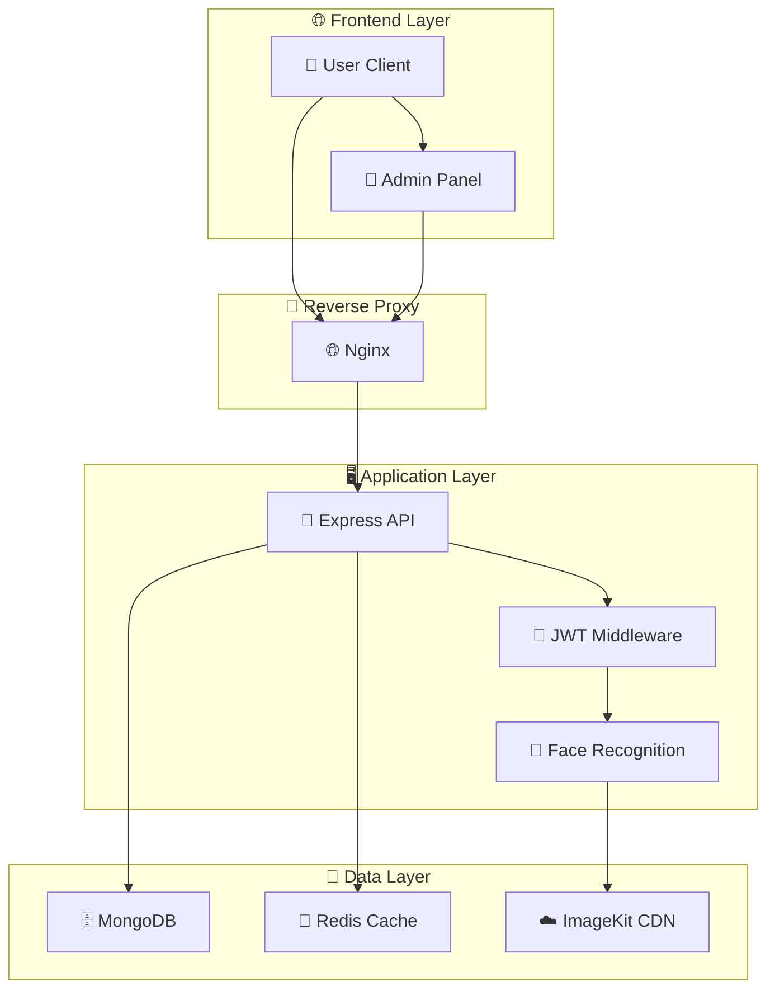

# 📁 Project Structure Documentation

## Face Recognition Attendance System
*Created by [Aayush Vaghela](https://github.com/AAYUSH412)*

---

## 🏗️ Complete Project Structure

```
Face-Recognition-Attendance-System/
├── 📄 README.md                    # Main project documentation
├── 📄 LICENSE                      # MIT License
├── 📄 .gitignore                   # Git ignore rules
├── 📄 .dockerignore                # Docker ignore rules
├── 🐳 Dockerfile                   # Production Docker configuration
├── 🐳 docker-compose.yml           # Production Docker Compose
├── 🐳 docker-compose.dev.yml       # Development Docker Compose
├── ⚙️ .env.example                 # Environment variables template
├── 🚀 setup.sh                     # Automated setup script
│
├── 📂 docs/                        # Documentation
│   ├── 📄 PRD.md                   # Product Requirements Document
│   ├── 📄 API.md                   # API Documentation
│   ├── 📄 DEPLOYMENT.md            # Deployment Guide
│   └── 📄 CONTRIBUTING.md          # Contribution Guidelines
│
├── 📂 scripts/                     # Deployment & Management Scripts
│   ├── 🚀 deploy.sh               # Main deployment script
│   ├── 📊 monitor.sh              # System monitoring
│   ├── 💾 backup.sh               # Database backup
│   └── 🧹 cleanup.sh              # System cleanup
│
├── 📂 docker/                      # Docker Configuration Files
│   ├── ⚙️ nginx.conf              # Nginx configuration
│   ├── ⚙️ supervisord.conf        # Supervisor configuration
│   ├── 🚀 startup.sh              # Container startup script
│   ├── 📄 mongo-init.js           # MongoDB initialization
│   └── 🔒 ssl/                    # SSL certificates directory
│
├── 📂 server/                      # Node.js Backend
│   ├── 📄 package.json            # Server dependencies
│   ├── 📄 index.js                # Main server file
│   ├── 🐳 Dockerfile.dev          # Development Docker config
│   ├── ⚙️ .env.local              # Local environment variables
│   │
│   ├── 📂 controllers/            # Request handlers
│   │   ├── 📄 authController.js   # Authentication logic
│   │   ├── 📄 userController.js   # User management
│   │   ├── 📄 attendanceController.js # Attendance logic
│   │   ├── 📄 eventController.js  # Event management
│   │   └── 📄 departmentController.js # Department management
│   │
│   ├── 📂 models/                 # Database Models
│   │   ├── 📄 User.js             # User schema
│   │   ├── 📄 Attendance.js       # Attendance schema
│   │   ├── 📄 Event.js            # Event schema
│   │   ├── 📄 EventAttendance.js  # Event attendance schema
│   │   └── 📄 Department.js       # Department schema
│   │
│   ├── 📂 routes/                 # API Routes
│   │   ├── 📄 auth.js             # Authentication routes
│   │   ├── 📄 users.js            # User routes
│   │   ├── 📄 attendance.js       # Attendance routes
│   │   ├── 📄 events.js           # Event routes
│   │   ├── 📄 departments.js      # Department routes
│   │   └── 📄 demo.js             # Demo/testing routes
│   │
│   ├── 📂 middleware/             # Express Middleware
│   │   ├── 📄 auth.js             # JWT authentication
│   │   ├── 📄 validation.js       # Input validation
│   │   ├── 📄 rateLimiting.js     # Rate limiting
│   │   └── 📄 errorHandler.js     # Error handling
│   │
│   ├── 📂 utils/                  # Utility Functions
│   │   ├── 📄 imagekit.js         # ImageKit integration
│   │   ├── 📄 qrCodeHelper.js     # QR code utilities
│   │   ├── 📄 hometempate.js      # Home page template
│   │   ├── 📄 emailService.js     # Email notifications
│   │   └── 📄 logger.js           # Logging utility
│   │
│   └── 📂 uploads/                # File uploads directory
│
├── 📂 client/                     # React Frontend (User Interface)
│   ├── 📄 package.json            # Client dependencies
│   ├── 📄 index.html              # HTML template
│   ├── 📄 vite.config.js          # Vite configuration
│   ├── 📄 tailwind.config.js      # TailwindCSS config
│   ├── 📄 postcss.config.js       # PostCSS config
│   ├── 📄 eslint.config.js        # ESLint configuration
│   ├── 🐳 Dockerfile.dev          # Development Docker config
│   │
│   ├── 📂 public/                 # Static Assets
│   │   ├── 🖼️ icons8-attendance-48.png # App icon
│   │   └── 🖼️ vite.svg           # Vite logo
│   │
│   └── 📂 src/                    # Source Code
│       ├── 📄 main.jsx            # Application entry point
│       ├── 📄 App.jsx             # Main App component
│       ├── 🎨 index.css           # Global styles
│       │
│       ├── 📂 components/         # Reusable Components
│       │   ├── 📄 Layout.jsx      # Main layout wrapper
│       │   ├── 📄 PrivateRoute.jsx # Protected route component
│       │   ├── 📄 NotFound.jsx    # 404 page component
│       │   ├── 📄 Dashboard.jsx   # User dashboard
│       │   ├── 📄 Profile.jsx     # User profile
│       │   ├── 📄 Events.jsx      # Events listing
│       │   ├── 📄 AttendanceCapture.jsx # Face capture
│       │   ├── 📄 AttendanceHistory.jsx # Attendance history
│       │   └── 📄 QRCodeScanner.jsx # QR code scanner
│       │
│       ├── 📂 Auth/               # Authentication Components
│       │   ├── 📄 Login.jsx       # Login form
│       │   └── 📄 Register.jsx    # Registration form
│       │
│       ├── 📂 context/            # React Context
│       │   └── 📄 AuthContext.jsx # Authentication context
│       │
│       ├── 📂 utils/              # Utility Functions
│       │   ├── 📄 api.js          # API client
│       │   ├── 📄 faceRecognition.js # Face recognition utils
│       │   └── 📄 helpers.js      # General helpers
│       │
│       └── 📂 assets/             # Static Assets
│           └── 🖼️ react.svg      # React logo
│
├── 📂 admin/                      # React Admin Panel
│   ├── 📄 package.json            # Admin dependencies
│   ├── 📄 index.html              # HTML template
│   ├── 📄 vite.config.js          # Vite configuration
│   ├── 📄 tailwind.config.js      # TailwindCSS config
│   ├── 📄 postcss.config.js       # PostCSS config
│   ├── 📄 eslint.config.js        # ESLint configuration
│   ├── 🐳 Dockerfile.dev          # Development Docker config
│   │
│   ├── 📂 public/                 # Static Assets
│   │   └── 🖼️ vite.svg           # Vite logo
│   │
│   └── 📂 src/                    # Source Code
│       ├── 📄 main.jsx            # Application entry point
│       ├── 📄 App.jsx             # Main App component
│       ├── 🎨 index.css           # Global styles
│       │
│       ├── 📂 components/         # Reusable Components
│       │   ├── 📄 AdminLayout.jsx # Admin layout wrapper
│       │   ├── 📄 AdminPrivateRoute.jsx # Protected admin route
│       │   └── 📄 NotFound.jsx    # 404 page component
│       │
│       ├── 📂 pages/              # Page Components
│       │   ├── 📄 AdminLogin.jsx  # Admin login
│       │   ├── 📄 Dashboard.jsx   # Admin dashboard
│       │   ├── 📄 Users.jsx       # User management
│       │   ├── 📄 UserDetail.jsx  # User details
│       │   ├── 📄 Events.jsx      # Event management
│       │   ├── 📄 EventForm.jsx   # Event creation/editing
│       │   ├── 📄 EventDetail.jsx # Event details
│       │   ├── 📄 EventAttendees.jsx # Event attendees
│       │   ├── 📄 Attendance.jsx  # Attendance reports
│       │   └── 📄 Departments.jsx # Department management
│       │
│       ├── 📂 context/            # React Context
│       │   └── 📄 AdminAuthContext.jsx # Admin auth context
│       │
│       └── 📂 utils/              # Utility Functions
│           ├── 📄 api.js          # API client
│           └── 📄 helpers.js      # General helpers
│
├── 📂 uploads/                    # File Uploads (Development)
│   ├── 📂 faces/                 # Face image uploads
│   ├── 📂 documents/             # Document uploads
│   └── 📂 temp/                  # Temporary files
│
├── 📂 logs/                       # Application Logs
│   ├── 📄 app.log                # Application logs
│   ├── 📄 error.log              # Error logs
│   └── 📄 access.log             # Access logs
│
└── 📂 backups/                   # Database Backups
    ├── 📄 mongodb_backup_20250822.gz
    └── 📄 ...
```

---

## 🚀 Key Components Explained

### 🐳 **Docker Configuration**

| File | Purpose |
|------|---------|
| `Dockerfile` | Multi-stage production build |
| `docker-compose.yml` | Production orchestration |
| `docker-compose.dev.yml` | Development environment |
| `docker/nginx.conf` | Reverse proxy configuration |
| `docker/supervisord.conf` | Process management |

### 🖥️ **Backend Architecture**

| Directory | Purpose |
|-----------|---------|
| `controllers/` | Business logic handlers |
| `models/` | MongoDB schema definitions |
| `routes/` | API endpoint definitions |
| `middleware/` | Express middleware functions |
| `utils/` | Shared utility functions |

### 🌐 **Frontend Architecture**

| Directory | Purpose |
|-----------|---------|
| `client/src/components/` | User interface components |
| `client/src/Auth/` | Authentication forms |
| `admin/src/pages/` | Admin panel pages |
| `context/` | React state management |
| `utils/` | Frontend utility functions |

### 📜 **Scripts & Automation**

| Script | Purpose |
|--------|---------|
| `setup.sh` | Interactive project setup |
| `scripts/deploy.sh` | Deployment management |
| `scripts/monitor.sh` | System monitoring |
| `scripts/backup.sh` | Database backup |

---

## 🔧 **Configuration Files**

### **Environment Configuration**
- `.env.example` - Template for environment variables
- `server/.env.local` - Server-specific environment
- Various `package.json` files for dependencies

### **Build Configuration**
- `vite.config.js` - Frontend build configuration
- `tailwind.config.js` - CSS framework configuration
- `eslint.config.js` - Code linting rules

### **Docker Configuration**
- Multi-environment Docker setups
- Health checks and monitoring
- Service orchestration and networking

---

## 📊 **Data Flow Architecture**



---

## 🎯 **Development Workflow**

1. **📋 Planning**: Requirements in `docs/PRD.md`
2. **🔧 Setup**: Automated with `setup.sh`
3. **💻 Development**: Hot reload with Docker Compose
4. **🧪 Testing**: API testing with Postman collections
5. **🚀 Deployment**: Containerized with Docker
6. **📊 Monitoring**: Health checks and logging
7. **💾 Backup**: Automated database backup

---

## 🔒 **Security Measures**

- **🔐 Authentication**: JWT-based secure authentication
- **🛡️ Authorization**: Role-based access control
- **🔒 Data Protection**: Encrypted passwords and secure sessions
- **🚫 Rate Limiting**: API rate limiting and DDoS protection
- **✅ Input Validation**: Comprehensive input sanitization
- **🔍 Audit Logging**: Complete audit trail

---

*This structure represents a production-ready, scalable, and maintainable codebase designed for educational and professional use.*
